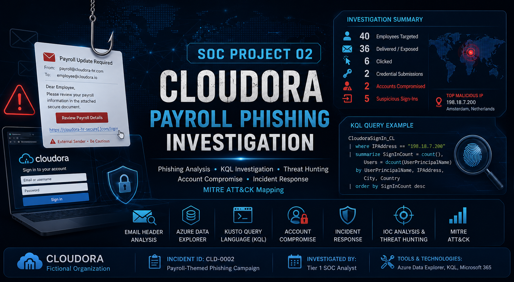


# 🛡️ SOC Project 02 — Cloudora Payroll Phishing Investigation

## Incident CLD-0002 | Phishing & Microsoft 365 Account Compromise

A Tier 1 SOC investigation of a simulated payroll-themed credential phishing campaign targeting employees of the fictional Cloudora organization.

This project demonstrates practical SOC investigation skills using **email header analysis, Azure Data Explorer, Kusto Query Language (KQL), IOC analysis, authentication-log investigation, incident scoping, MITRE ATT&CK mapping, and incident response documentation**.

> **Training Disclaimer:** Cloudora is a fictional organization and all email addresses, IP addresses, domains, URLs, identities, and telemetry used in this project are synthetic training data.

---

## 📌 Executive Summary

Cloudora investigated a payroll-themed phishing campaign designed to steal employee credentials through fraudulent HR/payroll portals.

Analysis of email and authentication telemetry identified:

- **40 employees targeted**
- **36 employees received at least one phishing message**
- **4 employees were fully protected by quarantine**
- **6 employees clicked a phishing link**
- **2 employees submitted credentials**
- **2 Microsoft 365 accounts were confirmed compromised**
- **5 suspicious successful sign-ins** originated from the identified attacker IP

The compromised accounts belonged to:

- `freya.lynn@cloudora.io`
- `ryan.boyd@cloudora.io`

Post-compromise authentication was observed from:

`198.18.7.200 — Amsterdam, Netherlands`

The attacker successfully accessed Microsoft 365 services using the compromised accounts.

Freya's account also showed SharePoint Online access. However, the available sign-in telemetry does **not establish that files were downloaded or data was exfiltrated**.

---

## 🎯 Investigation Objectives

The investigation was conducted to:

1. Determine whether the reported payroll email was malicious.
2. Identify phishing infrastructure and indicators of compromise.
3. Establish the scope of the phishing campaign.
4. Determine how many employees received the phishing messages.
5. Identify users who clicked the phishing links.
6. Determine whether credentials were submitted.
7. Investigate authentication activity associated with credential victims.
8. Identify confirmed compromised accounts.
9. Determine whether additional Cloudora accounts were affected.
10. Develop containment and remediation recommendations.

---

## 🛠️ Tools & Technologies

| Technology | Purpose |
|---|---|
| Azure Data Explorer | Security telemetry investigation |
| Kusto Query Language (KQL) | Log querying and correlation |
| Email Header Analysis | Sender and authentication investigation |
| SPF / DKIM / DMARC | Email authentication analysis |
| Microsoft 365 Sign-In Telemetry | Account compromise investigation |
| MITRE ATT&CK | Adversary behavior mapping |
| GitHub | Investigation documentation and portfolio presentation |

---

## 🔍 Email Investigation

### Variant A — Spoofed Cloudora Payroll Email

The first phishing variant impersonated Cloudora payroll and attempted to create urgency around an employee's salary payment.

Email authentication analysis identified:

- SPF: **Fail**
- DKIM: **Fail**
- DMARC: **Fail**
- Composite Authentication: **Fail**
- Originating IP: `198.18.44.23`
- Suspicious originating infrastructure
- Mismatched Reply-To domain
- Payroll-themed social engineering

The phishing URL was:

`hxxps://cloudora-hr-portal[.]example/payroll/login`

Evidence:

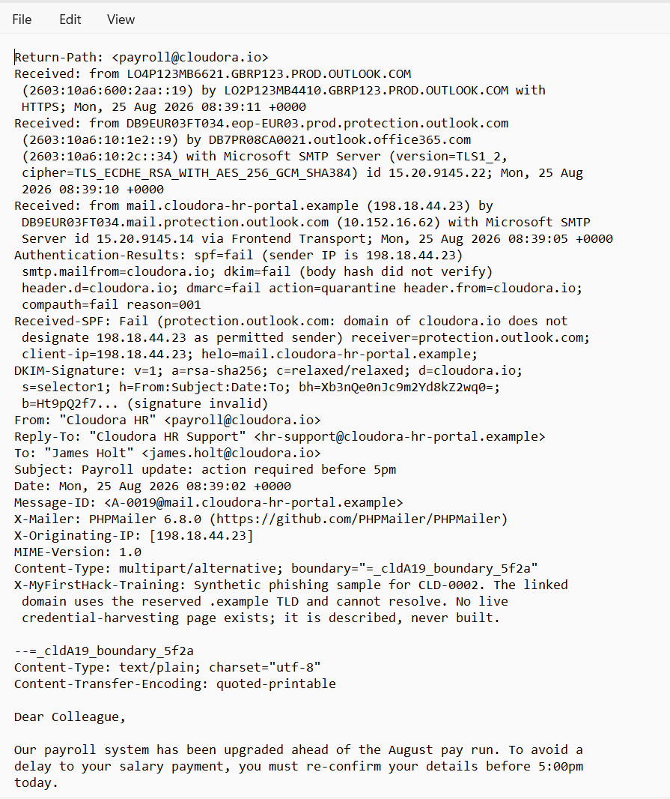

---

### Variant B — Authenticated Lookalike Domain

The second phishing variant demonstrated an important SOC analysis principle:

> **An email passing SPF, DKIM, and DMARC does not automatically mean the email is legitimate.**

Variant B successfully authenticated because the attacker controlled the lookalike domain:

`cloudora-hr-portal[.]example`

The authentication controls validated the attacker's domain — **not `cloudora.io`**.

The second phishing URL was:

`hxxps://login[.]cloudora-hr-portal[.]example/verify`

Evidence:

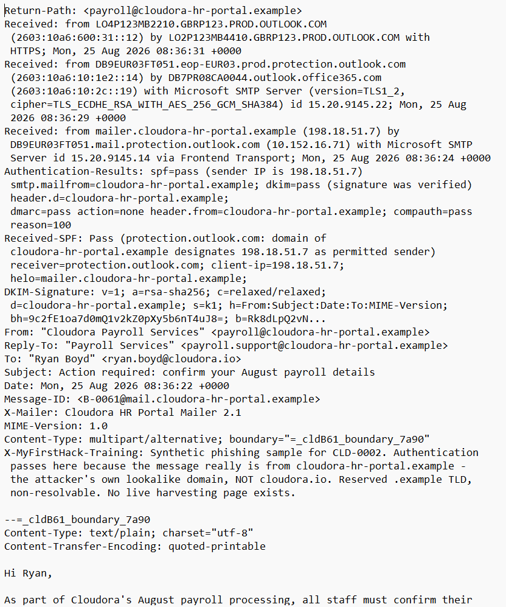

---

## 📊 Campaign Scope

KQL analysis identified multiple payroll phishing campaign variants and delivery actions.

The investigation established:

| Metric | Result |
|---|---:|
| Employees Targeted | **40** |
| Delivered / Exposed | **36** |
| Fully Protected by Quarantine | **4** |
| Users Who Clicked | **6** |
| Credential Submissions | **2** |
| Confirmed Compromised Accounts | **2** |
| Suspicious Attacker Sign-Ins | **5** |

Evidence:

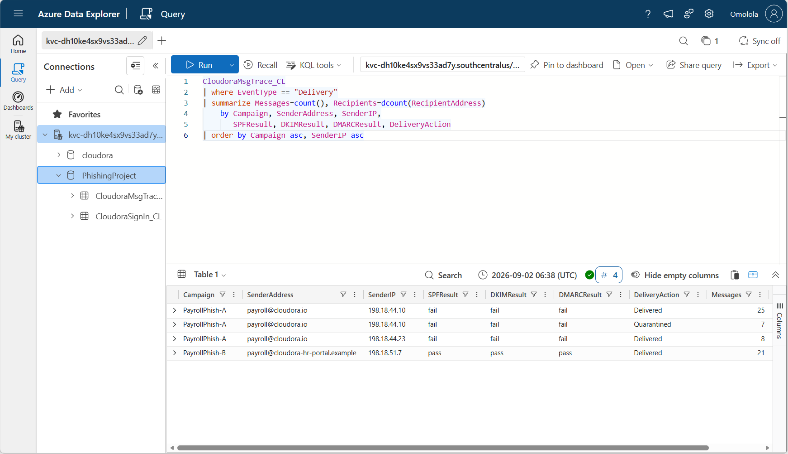

---

## 🖱️ Click & Credential Submission Analysis

KQL analysis identified **six users** who clicked phishing links.

Two users submitted credentials:

- `freya.lynn@cloudora.io`
- `ryan.boyd@cloudora.io`

This distinction was important because:

> **Clicking a phishing link does not automatically establish account compromise.**

Credential submission followed by anomalous successful authentication provided stronger evidence of compromise.

Evidence:

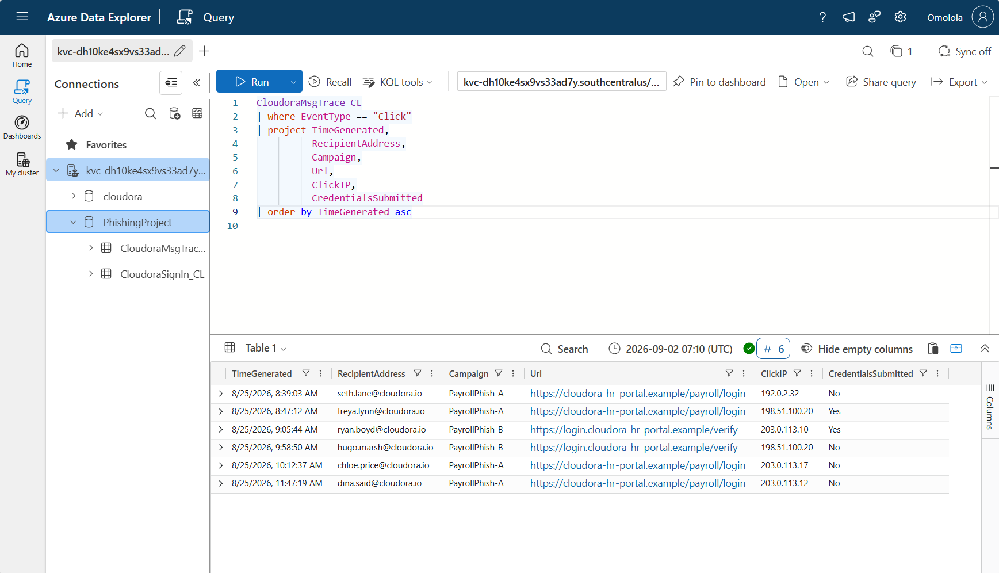

---

## 🚨 Account Compromise Investigation

Authentication telemetry for Freya Lynn and Ryan Boyd identified successful sign-ins from:

`198.18.7.200`

Location:

`Amsterdam, Netherlands`

### Freya Lynn

Observed attacker activity:

- Microsoft 365
- Outlook Web App
- SharePoint Online
- **3 suspicious successful sign-ins**

### Ryan Boyd

Observed attacker activity:

- Microsoft 365
- Outlook Web App
- **2 suspicious successful sign-ins**

Evidence:

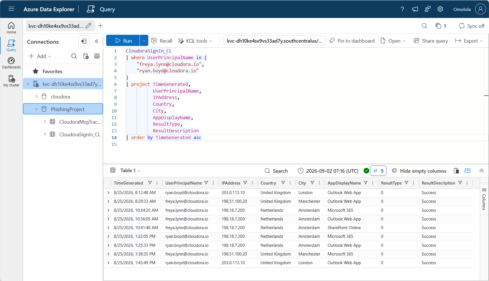

---

## 🌐 Attacker IP Pivot

The suspicious IP was pivoted across the available sign-in telemetry:

`198.18.7.200`

Results:

- **5 successful sign-ins**
- **2 affected users**
- Location: **Amsterdam, Netherlands**
- Affected users: **Freya Lynn and Ryan Boyd**

No additional accounts were observed authenticating from the confirmed attacker IP in the available dataset.

Evidence:

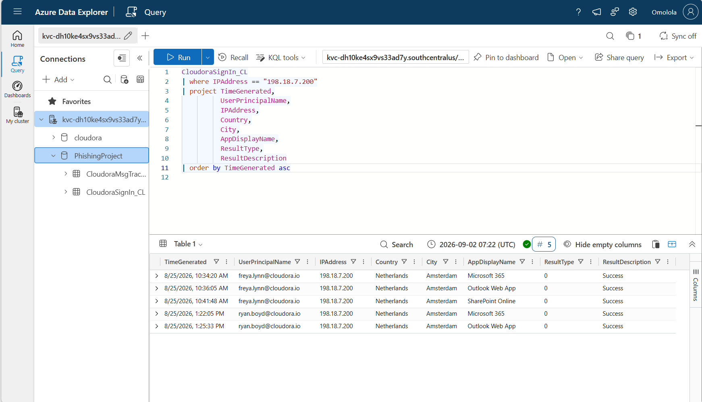

---

## ⏱️ Attack Timeline

Correlation of credential submission and suspicious authentication established the following sequence:

| Time (UTC) | User | Activity |
|---|---|---|
| 08:47:12 | Freya Lynn | Credentials submitted |
| 09:05:44 | Ryan Boyd | Credentials submitted |
| 10:34:20 | Freya Lynn | Suspicious Microsoft 365 sign-in |
| 10:36:05 | Freya Lynn | Suspicious Outlook Web App sign-in |
| 10:41:48 | Freya Lynn | Suspicious SharePoint Online sign-in |
| 13:22:05 | Ryan Boyd | Suspicious Microsoft 365 sign-in |
| 13:25:33 | Ryan Boyd | Suspicious Outlook Web App sign-in |

Approximate time from credential submission to first suspicious sign-in:

- **Freya:** 1 hour 47 minutes
- **Ryan:** 4 hours 16 minutes

Evidence:

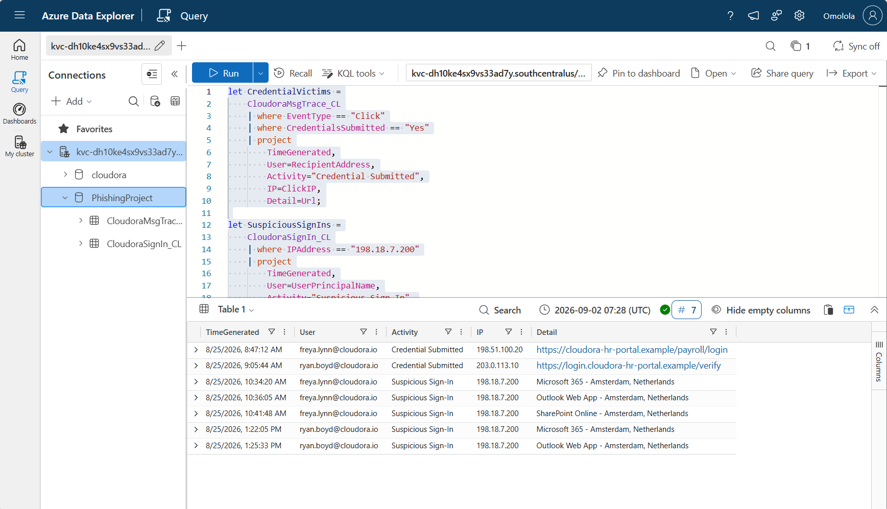

---

## 🌍 Environment-Wide Authentication Analysis

An environment-wide IP/location analysis was performed to determine whether the suspicious source was associated with additional accounts.

The Amsterdam source:

`198.18.7.200`

was associated with only the two confirmed compromised users in the available dataset.

Evidence:

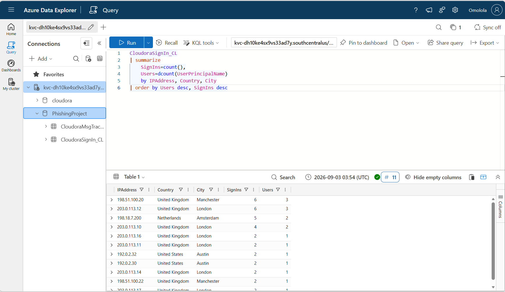

---

## 🔐 Authentication Results

The available sign-in dataset contained:

- **35 total sign-in events**
- **35 successful authentication events**
- **No failed sign-ins represented in the dataset**

Therefore, the investigation does **not** claim that the attacker attempted and failed to access additional accounts.

Evidence:

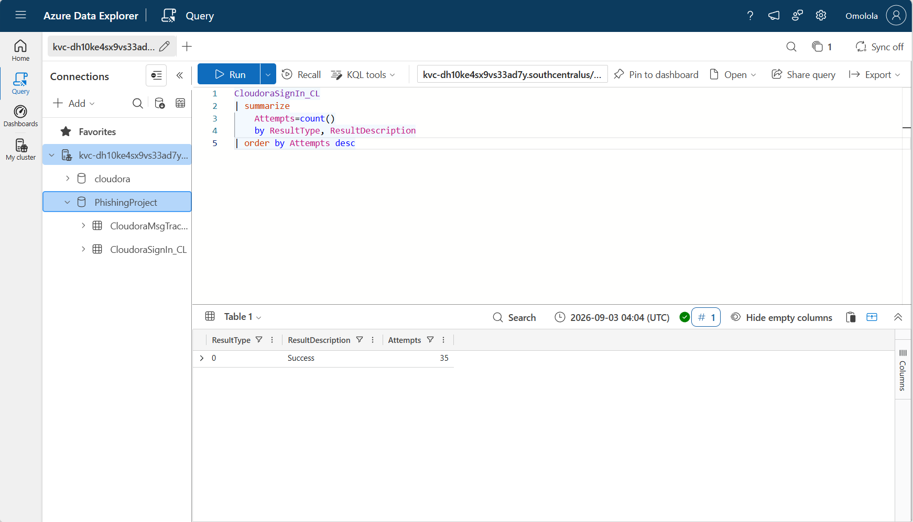

---

## 🧭 MITRE ATT&CK Mapping

| Tactic | Technique | ID | Investigation Evidence |
|---|---|---|---|
| Initial Access | Spearphishing Link | **T1566.002** | Payroll-themed messages directed employees to fraudulent HR/payroll portals |
| Initial Access | Cloud Accounts | **T1078.004** | Compromised Microsoft 365 credentials were used for successful cloud authentication |

The mapping is intentionally limited to techniques supported by the available evidence.

---

## 🔎 Indicators of Compromise

| IOC Type | Indicator | Context |
|---|---|---|
| IP Address | `198.18.7.200` | Confirmed suspicious sign-in source |
| Domain | `cloudora-hr-portal[.]example` | Lookalike phishing domain |
| URL | `hxxps://cloudora-hr-portal[.]example/payroll/login` | Variant A credential phishing |
| URL | `hxxps://login[.]cloudora-hr-portal[.]example/verify` | Variant B credential phishing |
| Sender IP | `198.18.44.23` | Variant A infrastructure |
| Sender IP | `198.18.51.7` | Variant B infrastructure |

---

## 🛡️ Containment & Remediation

Recommended response actions include:

- Temporarily restrict the two compromised accounts.
- Force password resets for the two confirmed compromised accounts.
- Revoke active sessions and refresh tokens.
- Review and validate registered MFA methods.
- Review application consent and connected applications.
- Review mailbox forwarding and inbox rules.
- Remove delivered phishing messages from affected mailboxes.
- Block identified phishing domains, URLs, and malicious infrastructure.
- Investigate Freya's SharePoint activity for unauthorized file activity.
- Notify affected users.
- Increase monitoring for related authentication activity.
- Strengthen MFA and Conditional Access controls.
- Improve lookalike-domain and phishing detection.

### Data Access Limitation

SharePoint Online authentication was observed through Freya Lynn's compromised account.

The available evidence does **not** prove that data was downloaded, modified, shared, deleted, or exfiltrated.

Additional SharePoint audit-log analysis would be required to establish data impact.

---

## 💻 KQL Investigation Queries

The complete KQL investigation query pack is available here:

➡️ [`queries/investigation-queries.kql`](queries/investigation-queries.kql)

The query pack includes:

- Campaign scoping
- Delivered-recipient analysis
- Quarantine analysis
- Click investigation
- Credential-submission analysis
- Compromised-account investigation
- Attacker-IP pivoting
- Timeline correlation
- Environment-wide authentication analysis
- Authentication-result analysis
- Near-miss user identification

---

## 📸 Investigation Evidence

All investigation screenshots are organized chronologically in:

➡️ [`screenshots/`](screenshots/)

The evidence collection includes **16 screenshots** covering email analysis, campaign scoping, click analysis, credential compromise, authentication investigation, IOC pivoting, and timeline correlation.

---

## 📄 Incident Report

The complete incident report is available in:

➡️ [`report/`](report/)

The report documents the investigation findings, scope, indicators of compromise, MITRE ATT&CK mapping, containment actions, remediation recommendations, and supporting evidence.

---

## 🧠 Key Lessons Learned

This investigation reinforced several SOC analysis principles:

- Email authentication success does not automatically establish legitimacy.
- Analysts must verify **which domain** passed SPF, DKIM, and DMARC.
- Clicking a phishing link is not equivalent to confirmed credential compromise.
- Authentication telemetry can validate the transition from phishing to account takeover.
- IOC pivoting helps determine the blast radius of an incident.
- Findings should distinguish confirmed evidence from assumptions.
- Successful cloud authentication alone does not prove data exfiltration.

---

---

## 🖼️ Investigation Evidence Gallery

The following screenshots document key stages of the CLD-0002 phishing investigation, from initial email analysis through campaign scoping and confirmation of Microsoft 365 account compromise.

### 1. Reported Phishing Email — Header Analysis


**Finding:** Analysis of the reported payroll email identified suspicious sender infrastructure and failed email-authentication controls consistent with phishing activity.

---

### 2. Phishing URL & Social-Engineering Pretext

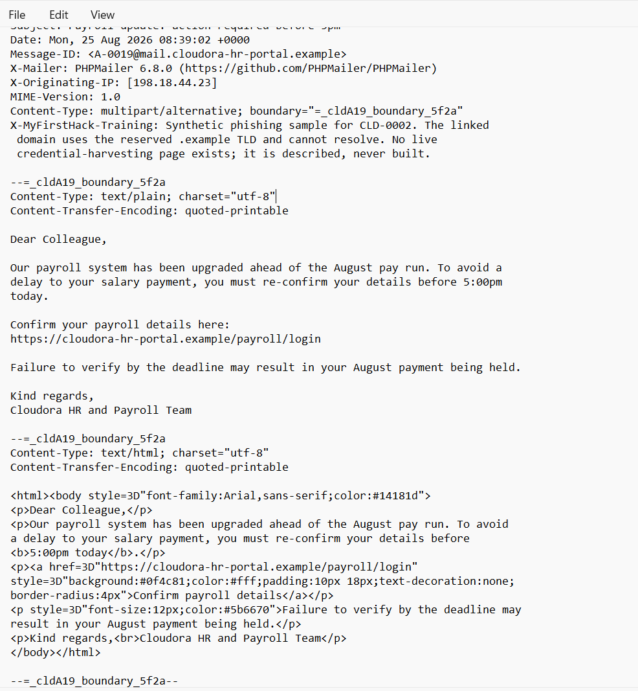

**Finding:** The message used payroll urgency and a fraudulent HR/payroll URL to pressure the recipient into reconfirming account information.

---

### 3. Campaign Scope — KQL Analysis


**Finding:** KQL analysis identified multiple payroll-phishing variants, including messages that failed SPF, DKIM, and DMARC and a lookalike-domain variant whose authentication checks passed for the attacker-controlled domain.

---

### 4. Click & Credential Submission Analysis


**Finding:** Six employees clicked phishing links. Two users submitted credentials, establishing the priority accounts for authentication-log investigation.

---

### 5. Compromised Account Sign-In Investigation


**Finding:** Authentication telemetry showed successful Microsoft 365 activity for the two credential-submission victims from Amsterdam, Netherlands, using suspicious source IP `198.18.7.200`.

---

### 6. Attacker IP Scope


**Finding:** Pivoting on `198.18.7.200` identified five successful suspicious sign-ins associated with the two compromised accounts.

---

### 7. Phishing-to-Compromise Timeline


**Finding:** Timeline correlation connected credential submission events with subsequent successful authentication from the suspicious Amsterdam infrastructure.

---

### 8. Compromised Account Summary

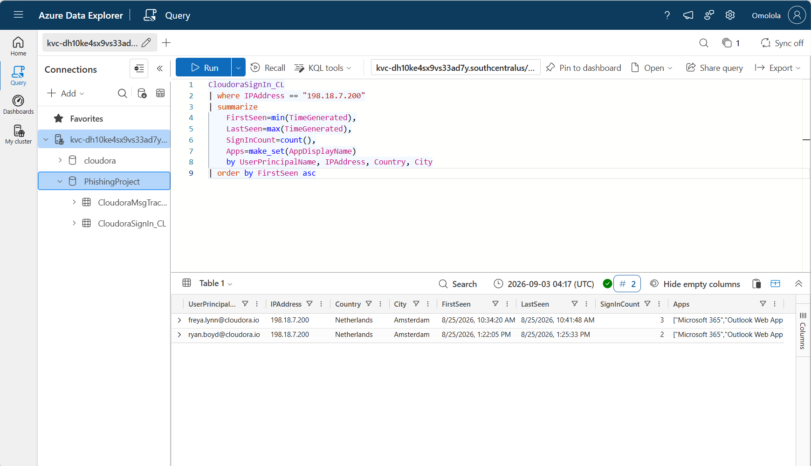

**Finding:** Investigation results confirmed two Microsoft 365 accounts as compromised following credential submission.

> **Evidence Note:** All identities, domains, IP addresses, URLs, email messages, and telemetry shown in this project are synthetic training data from the fictional Cloudora environment.

## 🏁 Conclusion

The CLD-0002 investigation identified and scoped a simulated payroll-themed phishing campaign targeting Cloudora employees. Email-header analysis and KQL investigation established that 40 employees were targeted, 36 received at least one phishing message, 6 users clicked a phishing link, and 2 users submitted credentials.

Authentication-log analysis subsequently confirmed that the two credential-submission accounts were accessed from the identified attacker IP address in Amsterdam, Netherlands, resulting in five suspicious successful sign-ins across Microsoft 365 services.

The investigation demonstrated an end-to-end Tier 1 SOC workflow involving phishing-email analysis, campaign scoping, IOC identification and pivoting, KQL-based log analysis, account-compromise validation, MITRE ATT&CK mapping, containment recommendations, and incident documentation.

The available telemetry confirmed unauthorized cloud-account access but did not provide sufficient evidence to conclude that data exfiltration occurred.

> **Final Assessment:** Confirmed phishing campaign with two compromised Microsoft 365 accounts. Containment, credential reset, session revocation, IOC blocking, and continued monitoring are recommended.

---

## 📁 Repository Structure
```text

02-Cloudora-Phishing-Investigation/
│
├── README.md
│
├── assets/
│   ├── README.md
│   └── cloudora-phishing-investigation-banner.png
│
├── queries/
│   └── investigation-queries.kql
│
├── report/
│   ├── README.md
│   └── Cloudora_CLD-IR-0002 Omolola Incident Report.docx
│
└── screenshots/
    ├── README.md
    ├── 01-reported-phish-header-analysis.png
    ├── 02-phishing-url-and-pretext.png
    ├── 03-legitimate-payroll-email-baseline.png
    ├── 04-variant-b-lookalike-domain-auth-pass.png
    ├── 05-variant-b-phishing-url-pretext.png
    ├── 06-benign-mailchimp-false-positive.png
    ├── 07-kql-campaign-scope-authentication.png
    ├── 08-kql-delivered-phish-recipients.png
    ├── 09-kql-quarantine-protected-users.png
    ├── 10-kql-clicks-and-credential-submissions.png
    ├── 11-kql-compromised-users-amsterdam-signins.png
    ├── 12-kql-attacker-ip-scope.png
    ├── 13-kql-phishing-compromise-timeline.png
    ├── 14-kql-environment-signin-ip-analysis.png
    ├── 15-kql-signin-result-summary.png
    └── 16-kql-compromised-account-summary.png
```

---

## 👩🏽‍💻 Analyst

**Omolola Babarinde**

Cybersecurity | SOC Analysis | GRC | IAM | Web Application Security

### Skills Demonstrated

`KQL` • `Azure Data Explorer` • `Phishing Analysis` • `Email Header Analysis` • `Incident Response` • `Microsoft 365 Security` • `IOC Analysis` • `MITRE ATT&CK` • `Security Documentation`

---

## ⚠️ Disclaimer

This repository documents a **simulated cybersecurity training exercise**. Cloudora is a fictional organization. All identities, domains, IP addresses, email messages, URLs, and security telemetry shown in this repository are synthetic and are used solely for educational and portfolio purposes.
